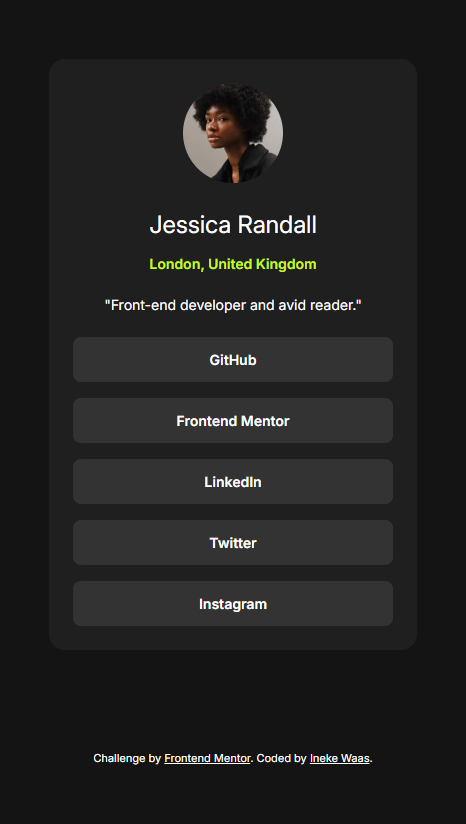
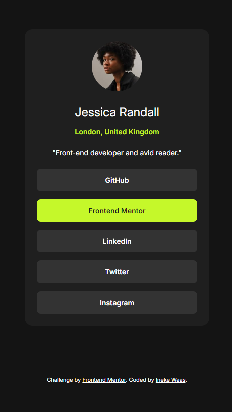

# Frontend Mentor - Social links profile solution

This is a solution to the [Social links profile challenge on Frontend Mentor](https://www.frontendmentor.io/challenges/social-links-profile-UG32l9m6dQ). Frontend Mentor challenges help you improve your coding skills by building realistic projects.

## Table of contents

- [Overview](#overview)
  - [The challenge](#the-challenge)
  - [Screenshot](#screenshot)
  - [Links](#links)
- [My process](#my-process)
  - [Built with](#built-with)
  - [What I learned](#what-i-learned)
  - [Continued development](#continued-development)
  - [Useful resources](#useful-resources)
- [Author](#author)
- [Acknowledgments](#acknowledgments)

**Note: Delete this note and update the table of contents based on what sections you keep.**

## Overview

### The challenge

Users should be able to:

- See hover and focus states for all interactive elements on the page

### Screenshot

### Links

- Solution URL: [Add solution URL here](https://your-solution-url.com)
- Live Site URL: [social links profile](https://ineke84.github.io/social-links-profile-main/)

## My process

### Built with

- Semantic HTML5 markup
- CSS custom properties
- Flexbox
- CSS Grid
- Mobile-first workflow

### What I learned

This challenge was mainly applying what I know and practicing.

Most interesting was focussing on making sure that you can go through the page with a keyboard. I already knew this should be doen for accessability, but now I also made sure and checked if it worked.

### Continued development

In the future I want to keep on focussing on accesability, for example through checking keyboard use of the website.

Implementing fonts I read and heared a bit more about as a result of this challenge. I believe I can learn a lot more about this.

## Author

- Frontend Mentor - [@yIneke84](https://www.frontendmentor.io/profile/Ineke84)
